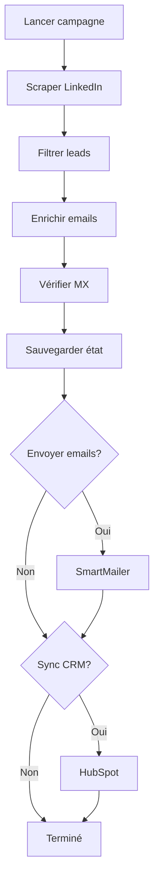

# 🚀 WALIDIA OMNI-OS

**Système de growth automation complet** - LinkedIn scraping + Email enrichment + Outreach automatisé + CRM sync

[](https://choosealicense.com/licenses/mit/)
[](https://www.python.org/downloads/)

## 📋 Vue d'ensemble

WALIDIA OMNI-OS est un framework Python complet de growth automation qui automatise l'ensemble du cycle de prospection B2B :
- 🔍 Scraping LinkedIn intelligent avec anti-détection
- 📧 Enrichissement d'emails multi-sources (waterfall pattern)
- ✉️ Outreach automatisé avec templates personnalisables
- 🔄 Synchronisation CRM (HubSpot) et notifications (Slack)
- 📊 Gestion d'état pour reprendre les campagnes interrompues

## 🏗️ Architecture

```
WALIDIA/
├── cli/
│   ├── __init__.py
│   └── main.py                  # Interface CLI avec Click/Typer
├── core/
│   ├── __init__.py
│   └── orchestrator.py          # GrowthOrchestrator - Boucle principale
├── scrapers/
│   ├── __init__.py
│   └── linkedin_scraper.py      # Scraper Playwright + stealth
├── enrichment/
│   ├── __init__.py
│   └── email_finder.py          # Waterfall email finder + MX verification
├── outreach/
│   ├── __init__.py
│   └── email_sender.py          # SmartMailer avec Jinja2
├── integrations/
│   ├── __init__.py
│   └── connectors.py            # HubSpot + Slack
├── templates/
│   ├── introduction.html
│   ├── follow_up_1.html
│   ├── follow_up_2.html
│   └── breakup.html
├── config/
│   ├── settings.yaml
│   └── campaigns/
├── data/
│   ├── leads/
│   └── logs/
├── requirements.txt
└── README.md
```

## 🚀 Installation

```bash
# Cloner le repository
git clone https://github.com/Walidisnt/WALIDIA-OMNI-OS.git
cd WALIDIA-OMNI-OS

# Installer les dépendances
pip install -r requirements.txt

# Installer Playwright
playwright install chromium

# Configurer les variables d'environnement
cp .env.example .env
# Éditer .env avec vos clés API
```

## ⚙️ Configuration

Créez un fichier `.env` à la racine :

```env
# LinkedIn
LINKEDIN_EMAIL=votre@email.com
LINKEDIN_PASSWORD=votrepassword

# Email enrichment APIs
HUNTER_API_KEY=your_key
APOLLO_API_KEY=your_key
SNOV_API_KEY=your_key
DROPCONTACT_API_KEY=your_key

# Email sending
SMTP_SERVER=smtp.gmail.com
SMTP_PORT=587
SMTP_USER=votre@email.com
SMTP_PASSWORD=your_app_password

# CRM & Notifications
HUBSPOT_API_KEY=your_key
SLACK_WEBHOOK_URL=your_webhook
```

## 💻 Utilisation

### Commandes CLI

```bash
# Lancer une nouvelle campagne
walidia launch "VP Sales SaaS France" --limit 100 --send-emails --sync-crm

# Reprendre une campagne interrompue
walidia resume campaign_abc123

# Exporter les résultats
walidia export campaign_abc123 --output leads.csv

# Surveiller le statut
walidia status --watch
```

### Utilisation programmatique

```python
from core import GrowthOrchestrator

# Initialiser l'orchestrateur
orchestrator = GrowthOrchestrator(
    campaign_name="Q1_2025_SaaS_Outreach",
    config_path="config/settings.yaml"
)

# Lancer une campagne complète
orchestrator.run_campaign(
    keyword="VP Sales SaaS",
    limit=100,
    send_emails=True,
    sync_crm=True
)

# Exporter les résultats
orchestrator.export_to_csv("data/leads/campaign_results.csv")
```

## 🧩 Modules

### 1. THE BRAIN - GrowthOrchestrator (`core/orchestrator.py`)

Orchestre le flux complet de la campagne :

```python
class GrowthOrchestrator:
    def run_campaign(self, keyword, limit, send_emails=False, sync_crm=False):
        """Exécute une campagne complète de A à Z."""
        # 1. Scraper LinkedIn
        leads = self.scraper.search_and_collect(keyword, limit)
        
        # 2. Filtrer les leads
        filtered_leads = self.filter_leads(leads)
        
        # 3. Enrichir avec emails
        enriched_leads = self.email_finder.enrich_batch(filtered_leads)
        
        # 4. Sauvegarder l'état
        self.save_campaign_state()
        
        # 5. Envoyer les emails
        if send_emails:
            self.mailer.send_campaign(enriched_leads)
        
        # 6. Sync CRM
        if sync_crm:
            self.hubspot.sync_campaign(self.campaign_id)
    
    def resume(self, campaign_id):
        """Reprend une campagne depuis son dernier état."""
        state = self.load_campaign_state(campaign_id)
        # Continue depuis l'étape interrompue
```

### 2. THE HANDS - LinkedInScraper (`scrapers/linkedin_scraper.py`)

Scraping intelligent avec anti-détection :

```python
class LinkedInScraper:
    def __init__(self):
        self.browser = None
        self.stealth_enabled = True
    
    async def human_behavior_simulation(self, page):
        """Simule un comportement humain réaliste."""
        # Scrolls aléatoires
        await page.evaluate("window.scrollBy(0, Math.random() * 500)")
        await asyncio.sleep(random.uniform(1.5, 3.5))
        
        # Mouvements de souris
        await page.mouse.move(random.randint(100, 800), random.randint(100, 600))
        await asyncio.sleep(random.uniform(0.5, 1.5))
    
    async def search_and_collect(self, keyword, limit):
        """Recherche et collecte des profils LinkedIn."""
        results = []
        # Rate limiting entre visites
        async for profile in self._paginate_search(keyword, limit):
            results.append(profile)
            await asyncio.sleep(random.uniform(10, 40))
        return results
```

### 3. THE REFINERY - EmailFinder (`enrichment/email_finder.py`)

Waterfall pattern pour trouver des emails :

```python
class EmailFinder:
    def find_best_email(self, lead):
        """Trouve le meilleur email via waterfall."""
        # Essayer Hunter.io
        email = self._from_hunter(lead)
        if email and self.verify_email(email):
            return email
        
        # Essayer Apollo
        email = self._from_apollo(lead)
        if email and self.verify_email(email):
            return email
        
        # Essayer Snov
        email = self._from_snov(lead)
        if email and self.verify_email(email):
            return email
        
        # Générer des permutations
        for email in self._generate_permutations(lead):
            if self.verify_email(email):
                return email
        
        return None
    
    def verify_email(self, email):
        """Vérifie l'email via DNS MX."""
        domain = email.split('@')[1]
        try:
            mx_records = dns.resolver.resolve(domain, 'MX')
            return len(list(mx_records)) > 0
        except:
            return False
```

### 4. THE VOICE - SmartMailer (`outreach/email_sender.py`)

Envoi d'emails avec templates Jinja2 :

```python
class SmartMailer:
    def __init__(self):
        self.env = Environment(loader=FileSystemLoader('templates'))
        self.daily_limit = 50
        self.sent_today = 0
    
    def send_campaign(self, leads, template_sequence=['introduction', 'follow_up_1']):
        """Envoie une séquence d'emails."""
        for lead in leads:
            if self.sent_today >= self.daily_limit:
                logger.info("Daily limit reached, pausing...")
                break
            
            for template_name in template_sequence:
                self._send_email(lead, template_name)
                self.sent_today += 1
                time.sleep(random.uniform(30, 90))  # Rate limiting
    
    def _send_email(self, lead, template_name):
        """Rend et envoie un email."""
        template = self.env.get_template(f'{template_name}.html')
        html = template.render(
            first_name=lead['first_name'],
            company=lead['company'],
            tracking_pixel=self._generate_tracking_pixel(lead['id'])
        )
        # Envoi SMTP...
```

### 5. THE TOOLS - Connectors (`integrations/connectors.py`)

```python
class HubSpotConnector:
    def sync_campaign(self, campaign_id):
        """Synchronise les leads vers HubSpot."""
        leads = self.load_campaign_leads(campaign_id)
        for lead in leads:
            self.create_or_update_contact(lead)
            self.create_or_update_company(lead['company'])
            self.create_deal(lead)

class SlackNotifier:
    def new_lead_notification(self, lead):
        """Envoie une notification pour un nouveau lead qualifié."""
        message = f"🎯 Nouveau lead : {lead['name']} @ {lead['company']}"
        self.send_message(message)
```

## 📊 Flux de campagne



## 🛡️ Fonctionnalités de sécurité

- ✅ **Anti-détection** : Playwright stealth + comportement humain simulé
- ✅ **Rate limiting** : Délais aléatoires entre actions
- ✅ **Gestion d'état** : Reprise de campagnes interrompues
- ✅ **Limites journalières** : Protection contre le spam
- ✅ **Vérification MX** : Évite les bounces
- ✅ **Cookies chiffrés** : Stockage sécurisé des sessions

## 📈 Métriques et suivi

- Nombre de profils scrapés
- Taux d'enrichissement d'emails
- Taux de délivrabilité
- Taux d'ouverture (via tracking pixels)
- Taux de réponse
- Leads synchronisés vers CRM

## 🤝 Contribution

Les contributions sont les bienvenues ! Consultez [CONTRIBUTING.md](CONTRIBUTING.md) pour plus de détails.

## 📝 Licence

Ce projet est sous licence MIT. Voir [LICENSE](LICENSE) pour plus d'informations.

## ⚠️ Avertissement

Ce projet est fourni à des fins éducatives. Assurez-vous de respecter :
- Les conditions d'utilisation de LinkedIn
- Les réglementations anti-spam (CAN-SPAM, GDPR)
- Les politiques des fournisseurs d'email
- Les lois locales sur la protection des données

## 📧 Support

Pour toute question ou problème, ouvrez une [issue](https://github.com/Walidisnt/WALIDIA-OMNI-OS/issues) sur GitHub.

---

**Développé avec ❤️ par [Walidisnt](https://github.com/Walidisnt)**
